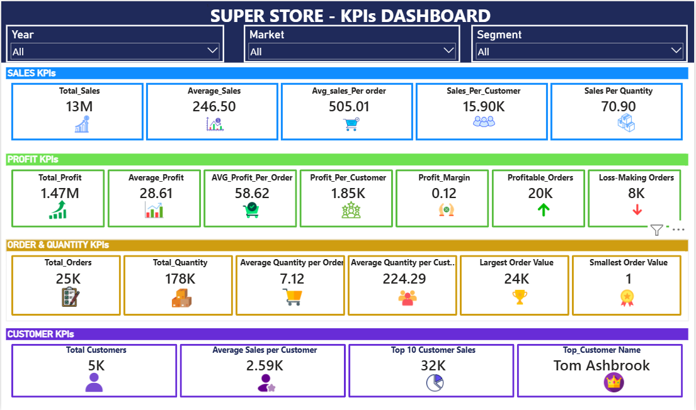

# 📊 Super Store KPI Dashboard

## 📌 Overview

This project presents an interactive **Super Store KPI Dashboard** developed using **Microsoft Power BI**.

The dashboard focuses on analyzing key business performance metrics across **Sales, Profit, Orders, Quantity, and Customers**.

It provides an interactive view of business performance using **DAX measures, KPI cards, and slicers**.

## 📊 Dashboard Preview

## 📌 Overview

This project presents an interactive **Super Store KPI Dashboard** developed using **Microsoft Power BI**.

The dashboard focuses on analyzing key business performance metrics across **Sales, Profit, Orders, Quantity, and Customers**.

It provides an interactive view of business performance using **DAX measures, KPI cards, and slicers**.

## 📊 Dashboard Preview

## 🔍 Key KPIs

### 📈 Sales KPIs

- 💰 Total Sales: **13M**
- 📊 Average Sales: **246.50**
- 🛒 Average Sales per Order: **505.01**
- 👥 Sales per Customer: **15.90K**
- 📦 Sales per Quantity: **70.90**

### 💰 Profit KPIs

- 💵 Total Profit: **1.47M**
- 📊 Average Profit: **28.61**
- 🛒 Average Profit per Order: **58.62**
- 👥 Profit per Customer: **1.85K**
- 📈 Profit Margin: **0.12**
- 🟢 Profitable Orders: **20K**
- 🔴 Loss-Making Orders: **8K**

### 📦 Order & Quantity KPIs

- 🧾 Total Orders: **25K**
- 📦 Total Quantity: **178K**
- 🛒 Average Quantity per Order: **7.12**
- 👥 Average Quantity per Customer: **224.29**
- 🏆 Largest Order Value: **24K**
- 🥇 Smallest Order Value: **1**

### 👥 Customer KPIs

- 👤 Total Customers: **5K**
- 💵 Average Sales per Customer: **2.59K**
- 📊 Top 10 Customer Sales: **32K**
- 👑 Top Customer: **Tom Ashbrook**

## ✨ Dashboard Features

- Interactive **Year** slicer
- Interactive **Market** slicer
- Interactive **Segment** slicer
- Sales KPI analysis
- Profit KPI analysis
- Order & Quantity KPI analysis
- Customer KPI analysis
- Profitable vs Loss-Making Orders
- Top Customer analysis
- Dynamic KPI values using DAX

## 🛠️ Tools & Skills Used

- Microsoft Power BI
- DAX
- Power Query
- Data Analysis
- Data Visualization
- KPI Development
- Interactive Dashboard Design

## 📐 DAX Measures

The dashboard includes multiple DAX measures to calculate:

- Total Sales
- Average Sales
- Average Sales per Order
- Sales per Customer
- Sales per Quantity
- Total Profit
- Average Profit
- Profit per Order
- Profit per Customer
- Profit Margin
- Profitable Orders
- Loss-Making Orders
- Total Orders
- Total Quantity
- Average Quantity per Order
- Average Quantity per Customer
- Largest Order Value
- Smallest Order Value
- Total Customers
- Average Sales per Customer
- Top 10 Customer Sales
- Top Customer Name

## 📁 Files Included

- `SuperStore_KPI_Dashboard.pbix` — Power BI dashboard file
- `SuperStore_KPI_Dashboard.png` — Dashboard preview
- `SuperStore.csv` — Dataset

## 🎯 Project Objective

The main objective of this project is to create an interactive KPI dashboard that helps users quickly understand **sales performance, profitability, order behavior, quantity trends, and customer performance**.

The dashboard demonstrates how raw business data can be transformed into **meaningful KPIs and an easy-to-understand visual report** using Power BI and DAX.

## ▶️ How to Use

1. Download the `.pbix` file.
2. Open it using **Power BI Desktop**.
3. Make sure the dataset is available if a refresh is required.
4. Use the **Year, Market, and Segment** slicers.
5. Explore the different KPI sections.
6. Analyze sales, profit, orders, quantity, and customer performance.

## 👨‍💻 Project

**Super Store KPI Dashboard using Power BI**

This project demonstrates practical skills in:

**Power BI | DAX | Power Query | Data Analysis | Data Visualization | Business Intelligence | KPI Development**

---

⭐ If you find this project useful, feel free to explore the dashboard and provide feedback!)

## 🔍 Key KPIs

### 📈 Sales KPIs

- 💰 Total Sales: **13M**
- 📊 Average Sales: **246.50**
- 🛒 Average Sales per Order: **505.01**
- 👥 Sales per Customer: **15.90K**
- 📦 Sales per Quantity: **70.90**

### 💰 Profit KPIs

- 💵 Total Profit: **1.47M**
- 📊 Average Profit: **28.61**
- 🛒 Average Profit per Order: **58.62**
- 👥 Profit per Customer: **1.85K**
- 📈 Profit Margin: **0.12**
- 🟢 Profitable Orders: **20K**
- 🔴 Loss-Making Orders: **8K**

### 📦 Order & Quantity KPIs

- 🧾 Total Orders: **25K**
- 📦 Total Quantity: **178K**
- 🛒 Average Quantity per Order: **7.12**
- 👥 Average Quantity per Customer: **224.29**
- 🏆 Largest Order Value: **24K**
- 🥇 Smallest Order Value: **1**

### 👥 Customer KPIs

- 👤 Total Customers: **5K**
- 💵 Average Sales per Customer: **2.59K**
- 📊 Top 10 Customer Sales: **32K**
- 👑 Top Customer: **Tom Ashbrook**

## ✨ Dashboard Features

- Interactive **Year** slicer
- Interactive **Market** slicer
- Interactive **Segment** slicer
- Sales KPI analysis
- Profit KPI analysis
- Order & Quantity KPI analysis
- Customer KPI analysis
- Profitable vs Loss-Making Orders
- Top Customer analysis
- Dynamic KPI values using DAX

## 🛠️ Tools & Skills Used

- Microsoft Power BI
- DAX
- Power Query
- Data Analysis
- Data Visualization
- KPI Development
- Interactive Dashboard Design

## 📐 DAX Measures

The dashboard includes multiple DAX measures to calculate:

- Total Sales
- Average Sales
- Average Sales per Order
- Sales per Customer
- Sales per Quantity
- Total Profit
- Average Profit
- Profit per Order
- Profit per Customer
- Profit Margin
- Profitable Orders
- Loss-Making Orders
- Total Orders
- Total Quantity
- Average Quantity per Order
- Average Quantity per Customer
- Largest Order Value
- Smallest Order Value
- Total Customers
- Average Sales per Customer
- Top 10 Customer Sales
- Top Customer Name

## 📁 Files Included

- `Superstore_KPI_Dashboard.pbix` — Power BI dashboard file
- `Super store KPIs Dashboard.png` — Dashboard preview
- `Super Store.csv` — Dataset

## 🎯 Project Objective

The main objective of this project is to create an interactive KPI dashboard that helps users quickly understand **sales performance, profitability, order behavior, quantity trends, and customer performance**.

The dashboard demonstrates how raw business data can be transformed into **meaningful KPIs and an easy-to-understand visual report** using Power BI and DAX.

## ▶️ How to Use

1. Download the `.pbix` file.
2. Open it using **Power BI Desktop**.
3. Make sure the dataset is available if a refresh is required.
4. Use the **Year, Market, and Segment** slicers.
5. Explore the different KPI sections.
6. Analyze sales, profit, orders, quantity, and customer performance.

## 👨‍💻 Project

**Super Store KPI Dashboard using Power BI**

This project demonstrates practical skills in:

**Power BI | DAX | Power Query | Data Analysis | Data Visualization | Business Intelligence | KPI Development**

---

⭐ If you find this project useful, feel free to explore the dashboard and provide feedback!
